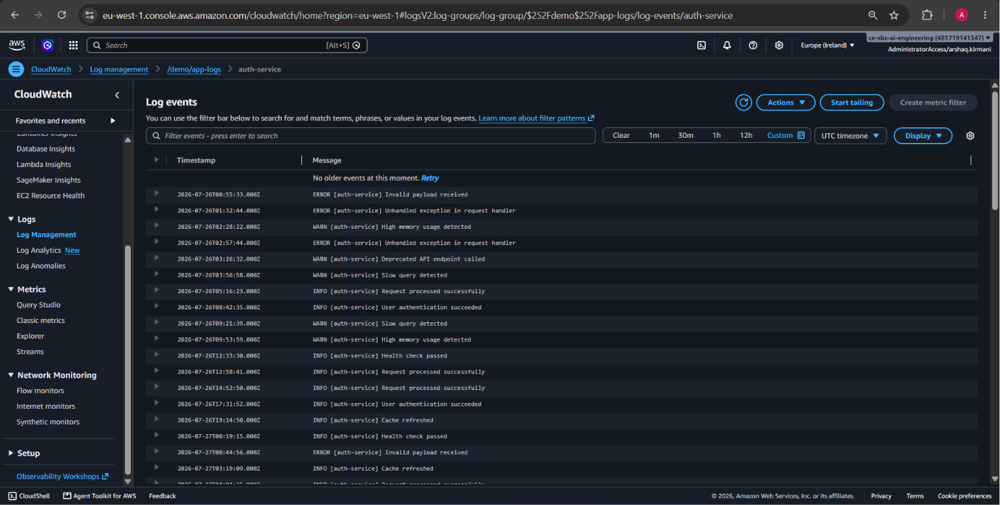
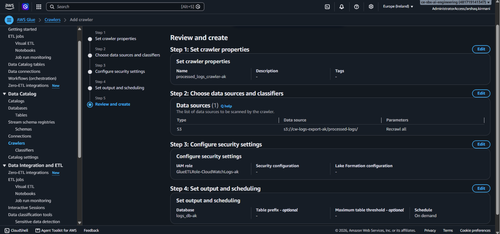
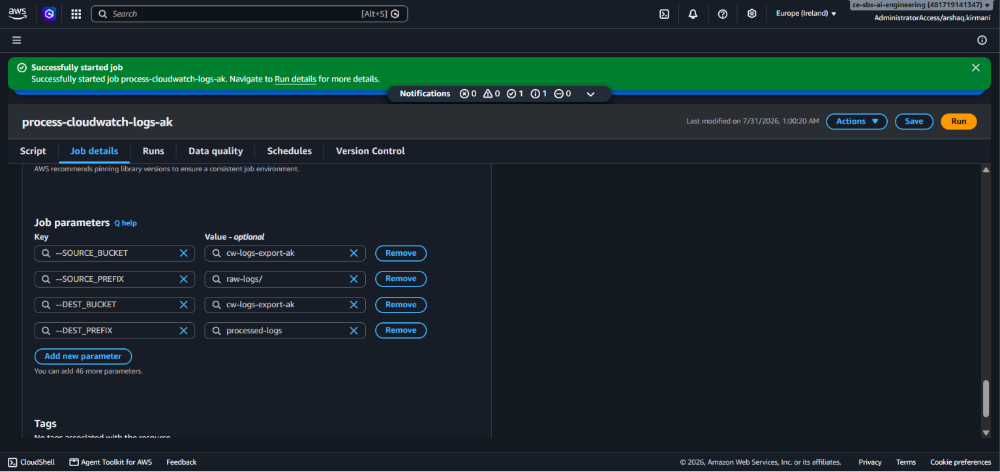
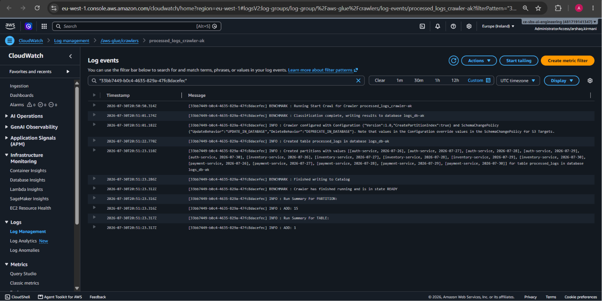
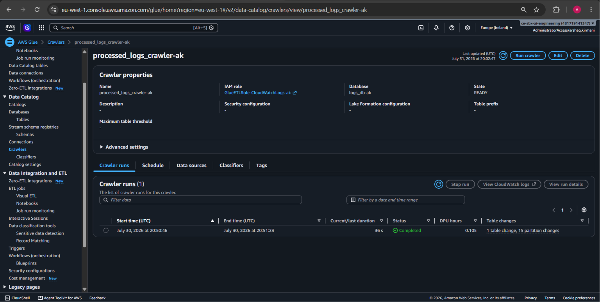
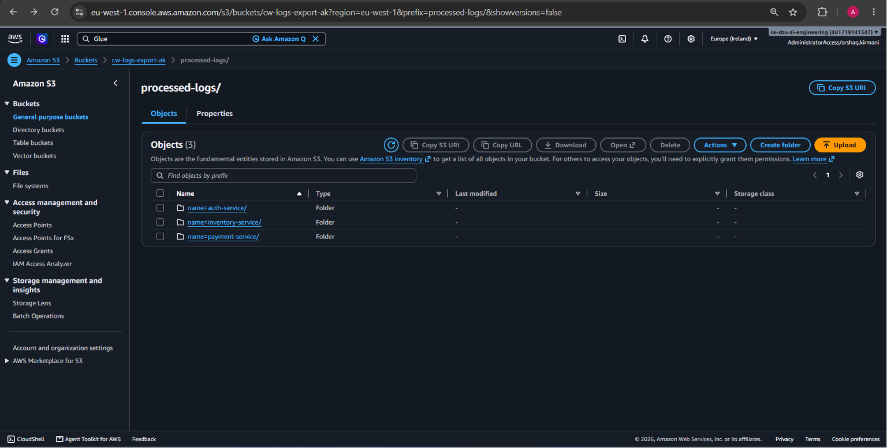
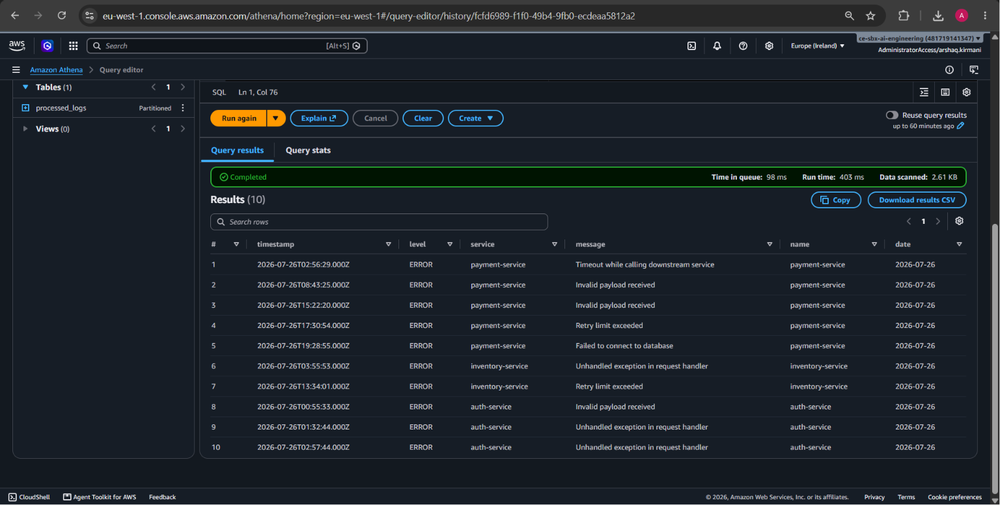

# CloudWatch Logs → Glue ETL → Athena Pipeline

## What this task does, in plain terms

Applications write logs (INFO, WARN, ERROR messages) into CloudWatch. This pipeline pulls those logs out, **keeps only the important ones (ERROR and INFO)**, organizes them neatly by service and date, and makes them instantly searchable with plain SQL in Athena.

Think of it as: **messy raw logs in → clean, filterable, queryable data out.**

## The flow, step by step

```
CloudWatch Logs  (raw logs, all levels: INFO/WARN/ERROR)
      │  export
      ▼
S3 (raw-logs/)   (.gz files, one per service)
      │  Glue ETL job: parse + filter (drop WARN) + partition
      ▼
S3 (processed-logs/)   (clean CSVs, organized as name=<service>/date=<date>/)
      │  Glue Crawler: scans and registers structure
      ▼
Glue Data Catalog   (metadata: "here's a table called processed_logs, here's its schema")
      │
      ▼
Athena   (SQL queries, e.g. "give me all ERRORs on 2026-07-26")
```

## What each part actually did

1. **Seeded dummy logs** — since there was no real running application, a Python script wrote fake log lines into 3 CloudWatch log streams (`auth-service`, `payment-service`, `inventory-service`), mixing INFO, WARN, and ERROR messages across several days.

2. **Exported CloudWatch → S3** — CloudWatch can't be queried directly by Glue, so an export task copied everything out as `.gz` text files into an S3 bucket (`raw-logs/`).

3. **Glue ETL job** — a Python script read every log line, pulled out the timestamp, level, service name, and message, **threw away anything that wasn't ERROR or INFO**, and wrote what was left into new CSV files organized in folders like `processed-logs/name=auth-service/date=2026-07-26/`.

4. **Glue Crawler** — scanned that folder structure and automatically figured out the table's columns, plus recognized `name` and `date` as **partitions** (searchable dimensions based on folder names, not extra data).

5. **Athena** — using the schema the crawler registered, lets you run SQL directly against the S3 files, e.g. filtering to one specific date without scanning everything.

## Screenshots

### 1. Raw CloudWatch logs (before processing)
CloudWatch Logs console showing the raw `auth-service` log stream — a mix of ERROR, WARN, and INFO entries exactly as they were generated, before any filtering happened.



### 2. Glue Crawler configuration
The crawler's "Review and create" summary — shows it was pointed at `s3://cw-logs-export-ak/processed-logs/`, using the `GlueETLRole-CloudWatchLogs-ak` IAM role, writing into the `logs_db-ak` database, running on demand.



### 3. Glue ETL job parameters
The ETL job (`process-cloudwatch-logs-ak`) job details screen, showing it started successfully, along with its 4 job parameters (`SOURCE_BUCKET`, `SOURCE_PREFIX`, `DEST_BUCKET`, `DEST_PREFIX`) that tell the script where to read from and write to.



### 4. Crawler execution logs
CloudWatch logs generated by the crawler's own run, showing it classified the data, created the `processed_logs` table in `logs_db-ak`, and registered all 15 partitions (one per service + date combination).



### 5. Crawler run history
The crawler's details page showing a completed run: 36 seconds, 1 table created, 15 partitions added — confirming the crawl finished successfully and picked up everything.



### 6. Processed output in S3
The `processed-logs/` folder in S3, showing the three `name=<service>/` folders (`auth-service`, `inventory-service`, `payment-service`) created by the ETL job — proof the data was partitioned by service as intended.



### 7. Athena query results
A query filtering for `level = 'ERROR'` on a specific date, returning only matching rows with clean column names (`timestamp`, `level`, `service`, `message`, `name`, `date`) — the final proof the whole pipeline works end to end.



## Result

The dummy CloudWatch logs are now fully pipelined into a queryable table. Running a query like:

```sql
SELECT * FROM processed_logs WHERE date = '2026-07-26' AND level = 'ERROR';
```

only scans the one matching partition folder instead of the entire dataset — this is the actual benefit of partitioning by `date` (and `name`), and it's confirmed by the "Data scanned" figure Athena reports after each query.

## Notes
- `WARN` level entries were intentionally generated and then filtered out by the ETL job, to prove the ERROR/INFO filtering logic actually works rather than just passing everything through.
- The Glue Crawler doesn't touch or move any data — it only inspects files and writes down their structure as metadata in the Glue Data Catalog.
- Partition values (`name`, `date`) come from the S3 folder names, not from inside the CSV files — this is why they show up as extra queryable columns without being duplicated in the data itself.
