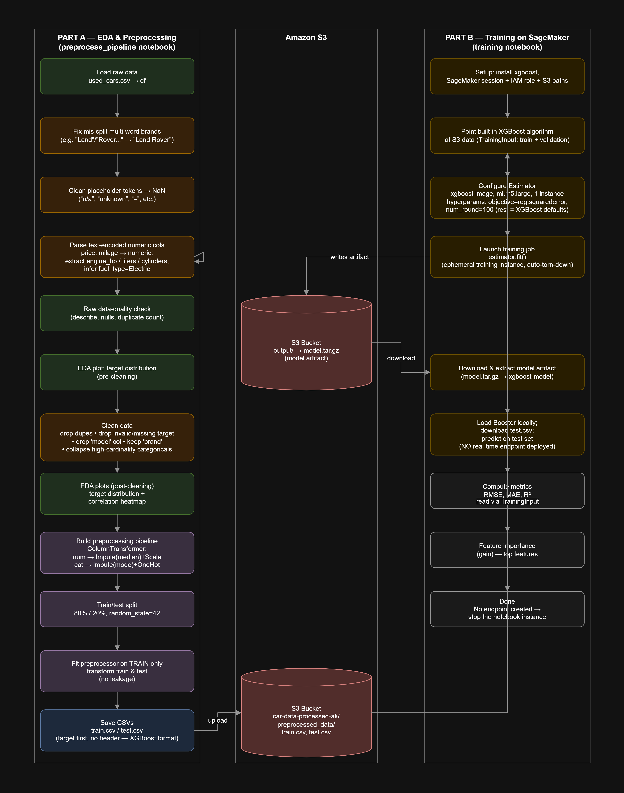
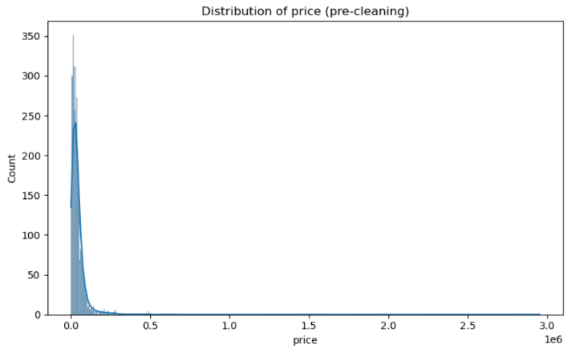
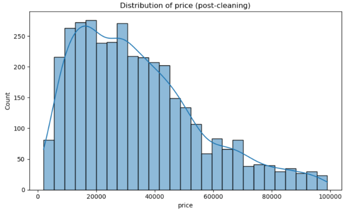
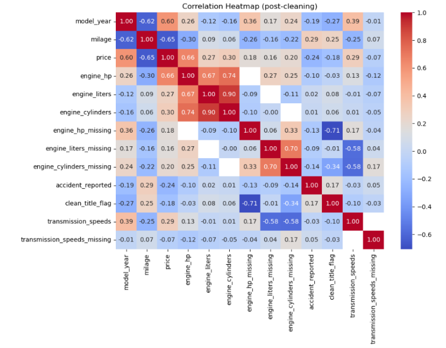

# Used Car Price Prediction — SageMaker Pipeline

This project predicts used car prices from a raw scraped dataset. It's split into two stages: a local **EDA & preprocessing** notebook that cleans the raw data and engineers features, and a **SageMaker training** notebook that trains a built-in XGBoost regressor on the processed data and evaluates it.

Raw listings go through cleaning, feature extraction, and a scikit-learn preprocessing pipeline before being split into train/test sets and uploaded to S3. From there, SageMaker's built-in XGBoost algorithm is pointed at the S3 data, trained on an ephemeral training instance, and the resulting model artifact is pulled back down and evaluated locally — no real-time endpoint is deployed.

## Pipeline Diagram

> The full editable version is in [`screenshots/car_price_ml_pipeline.drawio`](screenshots/car_price_ml_pipeline.drawio) — open it at [app.diagrams.net](https://app.diagrams.net). To embed it here as an image, open the file in draw.io and export it (File → Export as → PNG/SVG) as `screenshots/diagram.png`.

## EDA Plots

**Price distribution — pre-cleaning**
Target distribution before dropping duplicates, invalid targets, and outliers.

**Price distribution — post-cleaning**
Target distribution after cleaning, reflecting what the model was actually trained on.

**Correlation heatmap — post-cleaning**
Pairwise correlations between numeric features after cleaning.

## Results

Evaluated on the held-out 20% test set:

| Metric | Value |
|--------|-------|
| RMSE   | 8,224.95 |
| MAE    | 5,523.28 |
| R²     | 0.8401 |

## Repo Contents

| File / Folder | Description |
|------|-------------|
| `preprocess_pipeline.ipynb` | Cleans raw data, engineers features, builds the preprocessing pipeline, and writes `train.csv` / `test.csv` |
| `training.ipynb` | Trains SageMaker's built-in XGBoost on the processed data and evaluates it |
| `dataset/raw/` | Raw scraped data (`used_cars.csv`) |
| `dataset/preprocessed/` | Output of the preprocessing notebook (`train.csv`, `test.csv`) — also what's uploaded to S3 for training |
| `screenshots/` | EDA plots, pipeline diagram image, and the editable `car_price_ml_pipeline.drawio` source |
