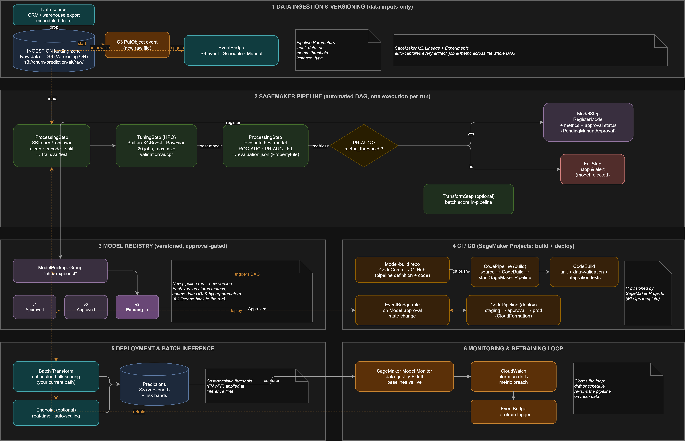

# Telco Customer Churn Prediction — End-to-End MLOps on AWS SageMaker

An end-to-end machine-learning project that predicts customer churn for a telecom
provider, from raw data through exploratory analysis, preprocessing, model training
and hyperparameter tuning on **Amazon SageMaker**, cost-sensitive evaluation, batch
inference, and a fully automated **SageMaker Pipeline** design covering data/model
versioning, CI/CD, and monitoring-driven retraining.

---

## Pipeline Architecture



The diagram shows the complete automated workflow across six stages: data ingestion
and versioning, the SageMaker Pipeline DAG (preprocess → tune → evaluate → condition →
register), the versioned Model Registry, CI/CD via SageMaker Projects, deployment and
batch inference, and a monitoring loop that triggers retraining on drift or schedule.

---

## What This Project Does

- **Predicts customer churn** on the Telco Customer Churn dataset (7,043 customers × 21 features) using a binary classifier trained with SageMaker's built-in **XGBoost** algorithm.
- **Explores the data** — class balance (~26.5% churn), feature distributions, outliers, and correlations — to surface the strongest churn drivers (contract type, tenure, payment method).
- **Cleans and prepares the data** — fixes the mistyped `TotalCharges` column, handles blank values for new customers, drops the identifier, encodes binary and multi-category fields, and produces a stratified 70/15/15 train/validation/test split with leakage-safe scaling.
- **Trains and tunes the model** with SageMaker **Hyperparameter Tuning (HPO)** — a Bayesian search that maximizes validation **PR-AUC** (`aucpr`), the right metric under class imbalance.
- **Evaluates rigorously** using ROC-AUC, PR-AUC, F1, precision, recall, and a confusion matrix on a held-out set, reaching ~0.85 ROC-AUC (this dataset's practical ceiling).
- **Applies a cost-sensitive decision threshold** — because missing a churner costs far more than a wasted retention offer, the operating point is chosen to minimize expected business cost rather than to maximize accuracy.
- **Runs batch inference** with SageMaker **Batch Transform** on unseen data, producing risk-banded churn predictions written back to S3.
- **Designs the automation** — a SageMaker Pipeline that turns the notebook workflow into a repeatable, versioned, CI/CD-driven DAG with a model registry, approval gates, and automated retraining.

---

## Repository Structure

```
.
├── README.md
├── screenshots/
│   └── pipeline.png                     # Architecture diagram (shown above)
├── dataset/
│   ├── raw/
│   │   └── data.csv                     # Raw Telco churn dataset
│   └── processed/
│       ├── train_clean.csv              # Preprocessing outputs
│       ├── val_clean.csv
│       └── test_clean.csv
├── notebooks/
│   ├── eda_telco_churn.ipynb            # Exploratory data analysis
│   ├── telco_churn_preprocessing.ipynb  # Cleaning, encoding, split, scale
│   └── telco_churn_sagemaker.ipynb      # Training, HPO, evaluation, batch inference
└── design/
    └── churn_pipeline.drawio            # Editable pipeline diagram (draw.io)
```

---

## Workflow

**1. Exploratory Data Analysis** — `eda_telco_churn.ipynb`
Profiles the dataset, checks data quality, and visualizes the drivers of churn through
distributions, cohort heatmaps, and feature-association measures.

**2. Preprocessing** — `telco_churn_preprocessing.ipynb`
Converts `TotalCharges` to numeric and fills new-customer blanks with 0, drops
`customerID`, collapses redundant service categories, binary- and one-hot-encodes the
categorical fields, performs a stratified 70/15/15 split, and standardizes numeric
features (scaler fit on train only). Outputs the three `*_clean.csv` files.

**3. Training, Tuning & Inference** — `telco_churn_sagemaker.ipynb`
Reads the processed splits from S3, reformats them to the label-first, headerless CSV
the built-in algorithm expects, trains a baseline XGBoost model, runs Bayesian HPO,
evaluates the best model, selects a cost-sensitive threshold, and demonstrates Batch
Transform inference on the held-out test set.

---

## Setup & Requirements

- An **AWS account** with access to Amazon SageMaker AI and an S3 bucket (this project uses `s3://churn-prediction-ak/`).
- A **SageMaker Notebook Instance** or **Studio** environment (Python 3, `boto3`, `sagemaker`, `pandas`, `scikit-learn`, `matplotlib`).
- An **execution role** with SageMaker and S3 permissions.

**To run:**
1. Upload `data.csv` to `s3://churn-prediction-ak/raw/`.
2. Run `telco_churn_preprocessing.ipynb` to generate the processed splits (saved to `dataset/processed/` and/or S3).
3. Open `telco_churn_sagemaker.ipynb`, set `SOURCE_BUCKET` / `SOURCE_PREFIX`, and run the cells top to bottom.

---

## Data Versioning, Model Versioning & CI/CD

- **Data versioning** — S3 Versioning on the data bucket plus execution-scoped prefixes keep every run's inputs immutable and recoverable; SageMaker ML Lineage traces each model back to the exact data that produced it.
- **Model versioning** — every pipeline run registers a new versioned model in the SageMaker **Model Registry** under one model-package group, with metrics, source data, and hyperparameters attached and gated behind manual approval.
- **CI/CD** — SageMaker Projects provisions a build pipeline (tests + launch the SageMaker Pipeline on code changes) and a deploy pipeline (deploy to staging/prod on model approval, via EventBridge and CloudFormation).
- **Retraining** — Model Monitor detects drift; CloudWatch and EventBridge re-trigger the pipeline on fresh data, closing the loop.

---

## Key Results

| Metric | Value |
|---|---|
| ROC-AUC | ~0.85 |
| PR-AUC | ~0.66 |
| Recall (cost-optimal threshold) | ~0.92 |
| Churn base rate | 26.5% |

The model captures the large majority of churners at the chosen cost-sensitive operating
point, prioritizing recall so that costly missed churners are minimized — the primary
business objective for a retention program.
