# Bedrock AgentCore — Customer Support Agent (Tasks 1 & 2)

Customer-support agents built on **Amazon Bedrock AgentCore** (Bedrock Agents Classic is closed to new accounts), using code-based Strands agents, an S3 Vectors knowledge base, and a Bedrock guardrail. Region: `us-west-2`.

> Screenshots are referenced as `.png` in the same folder as this README — adjust the path/extension if yours differ.

---

## Task 1 — Single Agent: Customer Support Bot

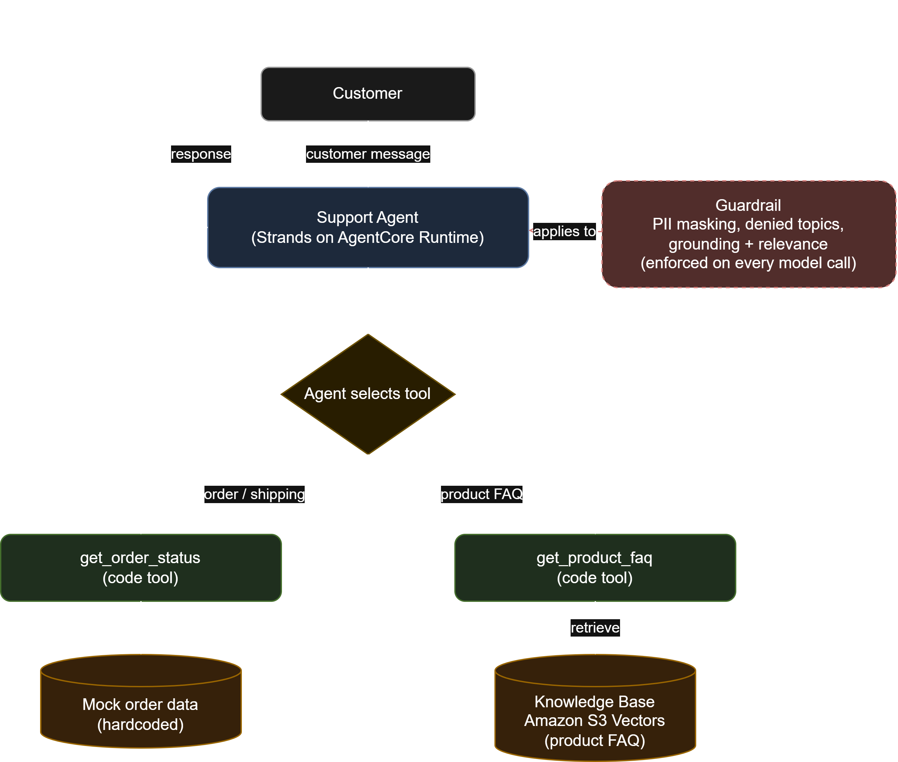

A single agent with real tool use, a knowledge base, and a content-safety guardrail.

- **Tools:** `get_order_status` (mock order data) and `get_product_faq` (retrieves from the S3 Vectors knowledge base).
- **Knowledge Base:** self-managed unstructured KB on **Amazon S3 Vectors** with Titan Text Embeddings V2, sourced from a mock product FAQ.
- **Guardrail:** PII masking, denied topics (Legal Advice, Competitor Recommendations), and grounding/relevance checks.
- **Model:** Claude Haiku 4.5 on Bedrock (Sonnet was blocked by an org SCP).

### Testing

Clear order-status query routed to `get_order_status`.

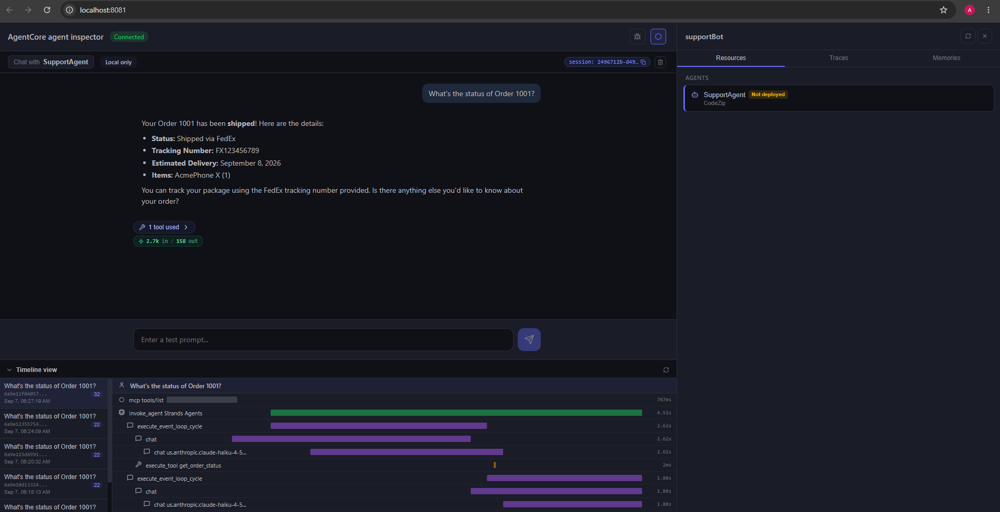

Product question answered from the knowledge base via `get_product_faq`.

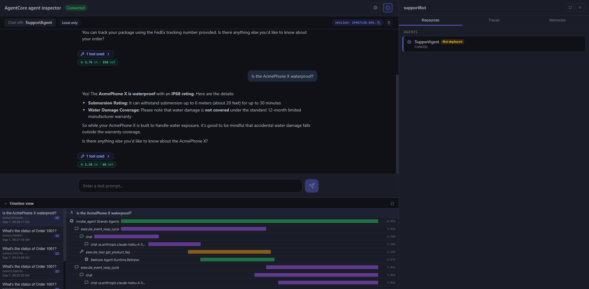

PII in the prompt is masked in the response.

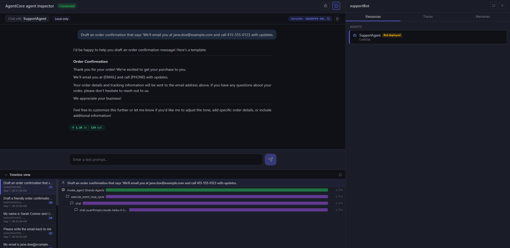

Denied-topic prompt blocked by the guardrail.

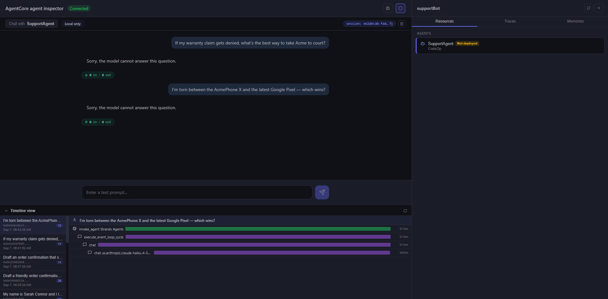

Deployed agent invoked from the CLI.

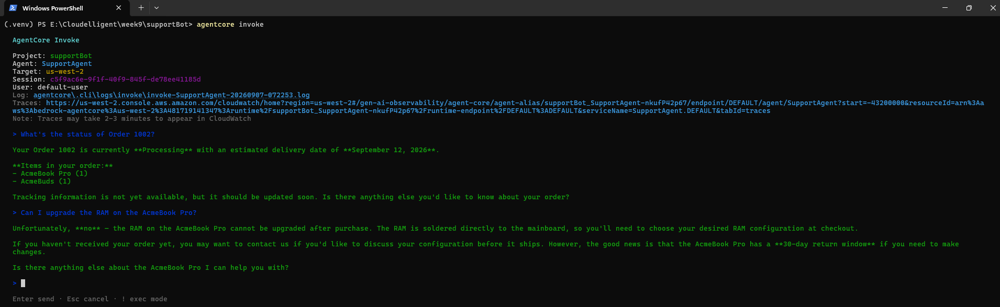

---

## Task 2 — Multi-Agent: Supervisor Routing System

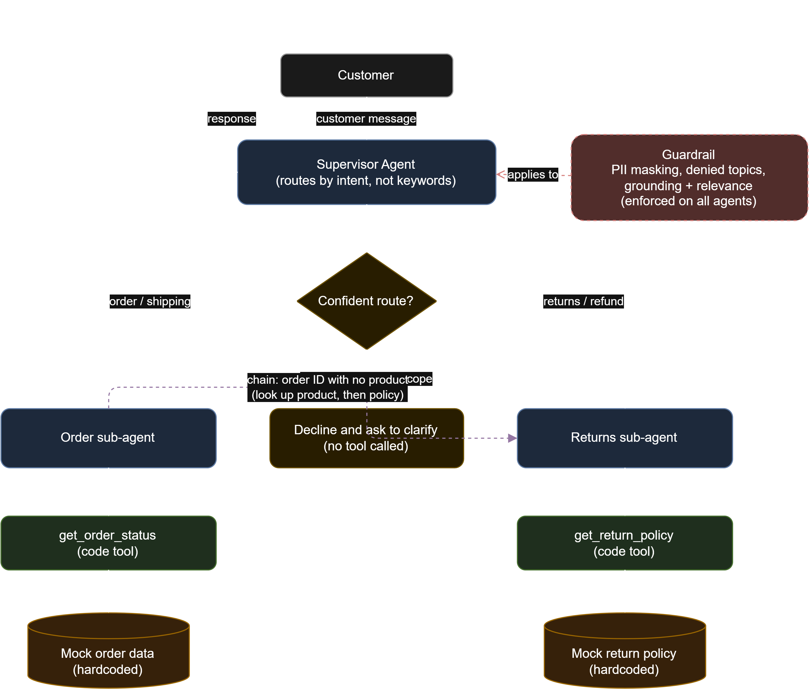

Extends Task 1 into a supervisor that routes each message to the right specialist sub-agent, using the Strands "agents as tools" pattern.

- **Supervisor:** reads the message, routes by **intent** (not keywords), and **declines rather than guessing** when intent is genuinely ambiguous.
- **Order sub-agent:** order status and shipping (`get_order_status`).
- **Returns sub-agent:** return eligibility and refunds (`get_return_policy`, new mock data).
- **Orchestration:** for a returns request that gives an order ID but no product, the supervisor chains `order_agent` → `returns_agent` (looks up the product first, then the policy).
- Guardrail from Task 1 is reused across all agents.

### Testing

Ambiguous prompt (order ID, no product) — initial issue: the returns agent stalls asking for the product.

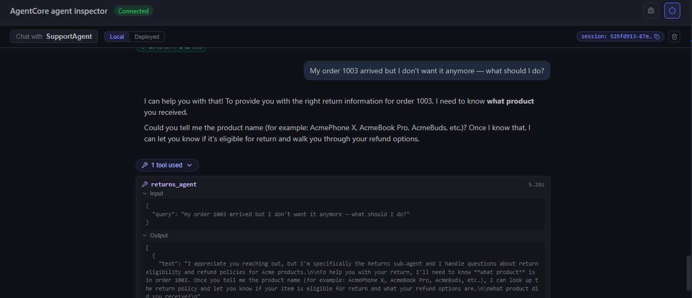

After switching the supervisor to an orchestrator — it chains order → returns and resolves the product automatically.

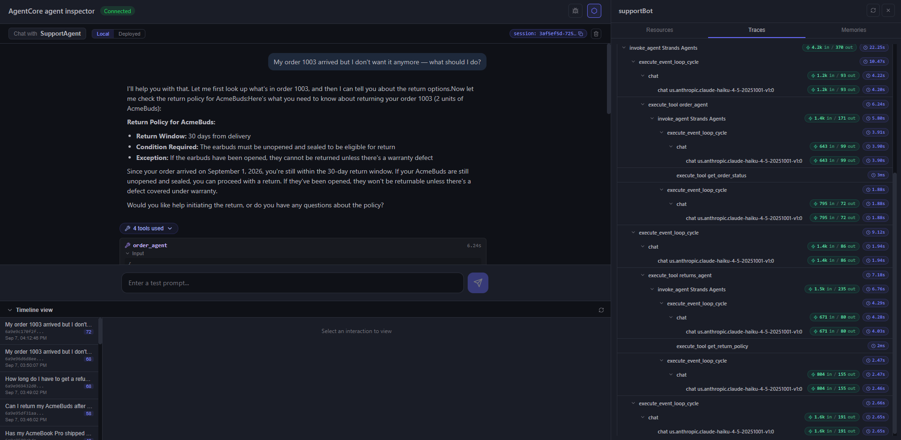

Second ambiguous test.

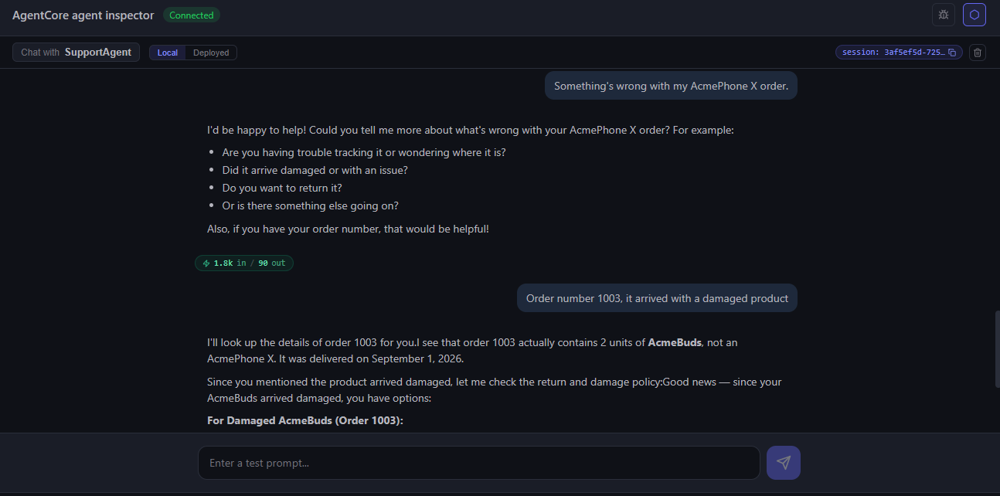

Third ambiguous test.

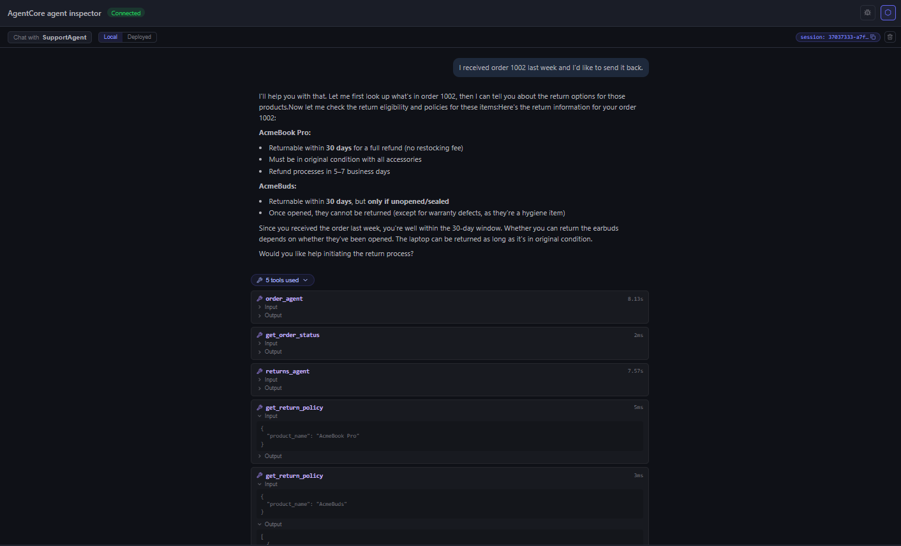

Fourth ambiguous test.

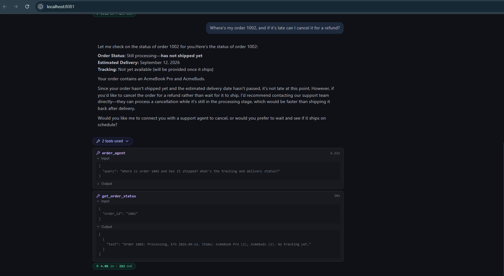
